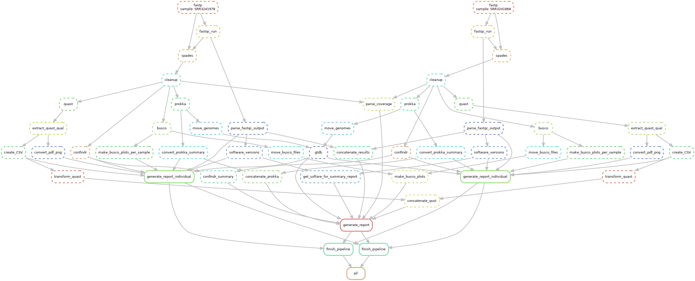

# Snakemake Pipeline for single-strain genome assembly

Authors: Simone Oberhaensli & Marco Kreuzer

Institution: Interfaculity Bioinformatics Unit (IBU), University of Bern

This is a snakemake pipeline for the assembly of bacterial single-strain genomes
and is specific to the IBU cluster environment using the slurm scheduler.

## Running the pipeline on IBU cluster

1. Deactivate any conda environment, also if you are in the `(base)` conda
environment.

`conda deactivate`

2. The script `run_sbatch.sh` will take care of running the pipeline. Inside the
script, the `snakemake` command is listed two times: The first line is outcommented
by default and runs the pipeline. The second line executes a dry run. You have
to outcomment the first `snakemake` command to actually run the pipeline.

This pipleine can run mulitple samples in parallel. Change `--jobs n` in the snakemake
command to specify the number of jobs send to the cluster.


## Pipeline Description

This snakemake pipeline performs the following tasks:

 - Read trimming with fastp and quality assessment with FASTQC

 - Assembly of the data with SPAdes

 - Removal of contigs shorter than 200bp

 - Quality assessment of the assembly with quast

 - Checks for contamination with confindr

 - Checks for completedness of the assembly with BUSCO4

 - Annotation of the assembly with prokka

 - Estimation of the taxonomy of the assembled genome with GTDB-TK

 Inteded use: single strain samples from Dialact (Agroscope)




## Files

### Config file

This file is in JSON format.

**Tool specifications**

* {tool}_version: the specific version used for the tool. If this option is missing,
the pipeline uses a local conda environment. The versions of the tools are stored in
the file "results/5_report/conda_software_versions.txt"

* {tool}_threads: the number of threads that are used

* {tool}_hours: the maximum number of hours before the job gets killed

* {tool}_mem_mb: the maximum number of RAM (in megabytes) to be used by this tool

* short_sh_commands_threads: Number of threads used for short bash commands. Usually used when one-liners are called.

* short_sh_commands_hours: Number of hours used for short bash commands.

*make sure to allocate enough memory to SPADes (>250GB) and GTDB-TK (>250GB)*


**Data specifications**

* DataFolder: Folder where the data is located. All forward and reverse reads have to be placed
in the folder: DataFolder/<Sample1>\_1.fastq.gz, DataFolder/<Sample1>\_2.fastq.gz, DataFolder/<Sample2>\_1.fastq.gz etc.

* extension: File extension (only tested with fastq.gz files. However, it could be <Sample>\_1.<anything>.gz)

**Test parameters**

These parameters are used for all tools for testing purposes with a small sample data set.

* testing_threads: Number of threads used for ALL tools in the testing case

* testing_hours: Number of hours used for ALL tools in the testing case

* testing_mem_mb: Number of memory in MB used for ALL tools in the testing case

## Creating the test environment

The following commands should produce a test folder. Inside this folder,
the same logic is reproduced but the data folder and the configuration about
threads, memory and running time are changed.

The data folder used for the testing the pipeline has to be specified in the
`config.json` file `DataFoler_testing: /path/to/files/`

```
chmod +x sync_test.sh # requires rsync
./sync_test.sh
```

This test can be run on the IBU cluster with the command:

```
cd test;
module load Utils/snakemake
/opt/cluster/software/Conda/miniconda/3/bin/snakemake --printshellcmds --drmaa " --partition=pall --ntasks=1 --mem={resources.mem_mb} --cpus-per-task={threads} --time={resources.hours}:0 --mail-type=END,FAIL " --latency-wait 300 --jobs 4 --jobname <jobname>_{jobid}
```

Note that the test will not run on pshort, since rule gtdb uses a lot of memory.

If this test finishes successfully, the whole script can be run with the actual data.


## Summary Report

If the pipeline finishes without errors, you can run the Rmarkdown script `report_assembly.Rmd`
and this will generate a summary of the assembly.
